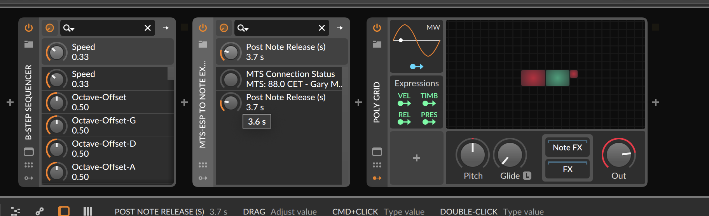

# tuning-note-claps

Beta (0.9.0) release

The "tuning-note-claps" CLAP plugins are a set of note effects which
convert microtuning gestures to CLAP note expressions. As of this writing
there are two plugins in the .clap file

1. MTSToNoteExpression: An MTS-ESP client which converts inbound notes to
a stream augmented with tuning note expressions based on an MTS-ESP master
2. EDNMToNoteExpression: A similar device which rather than using MTS-ESP allows
you to tune to an even division of N repetitions into M scales with a tuning
center and frequency

Defacto, the first means that you can use oddsound MTS-ESP to retune the 
bitwig polygrid and other devices.

The only un-obvious parameter is the "post note release". This is the amount
of time after a note off that the plugin continues to send note expression
events. This allows you to do morphing tuning in a release segment. If 
you never morph your tuning, you can set it to zero and everything is fine.

You can grab the clap from the release page here. Right now the mac binary
isn't signed so you may need to deal with that. Documentation forthcoming.
Or perhaps just signing instead. Place the clap in the system location and 
reindex!